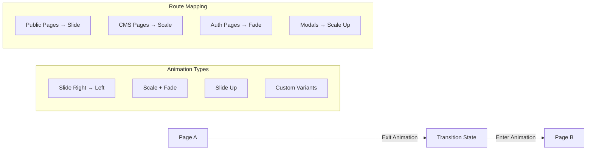
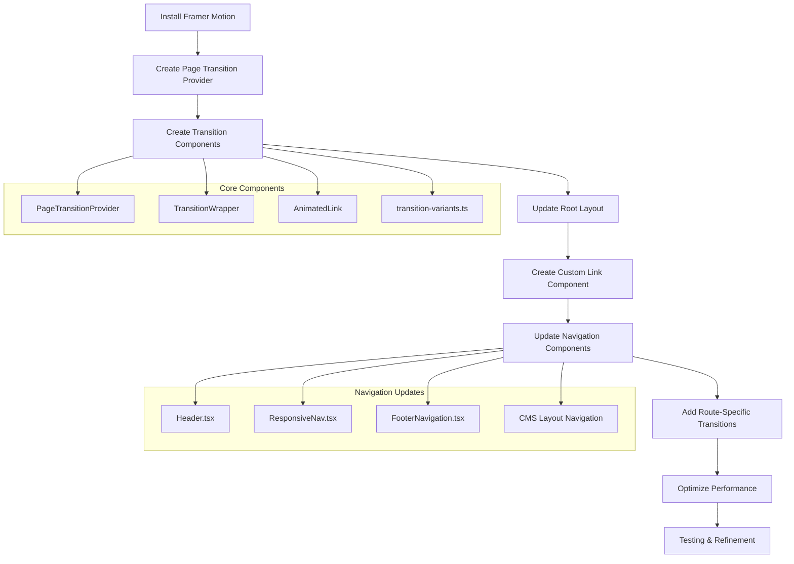

# Page Transitions Implementation Plan

## Project Overview

This document outlines the implementation plan for adding lightweight page transition animations to the Next.js CMS project. The goal is to implement dynamic transitions with slide and scale effects across the entire site to improve perceived performance and polish.

## Current Project Analysis

### Technology Stack
- **Framework**: Next.js with App Router
- **Styling**: Tailwind CSS with `tailwindcss-animate` plugin
- **UI Components**: Radix UI components
- **State Management**: React Context (Auth, Language, CurrentContent)
- **Database**: Supabase
- **Deployment**: Vercel-ready configuration

### Current Navigation Patterns
- Header navigation with responsive design
- Footer navigation
- CMS admin sidebar navigation
- Multi-language support with locale switching
- Dynamic routing for pages, posts, and CMS content

### Existing Dependencies
- React 19.0.0
- Next.js (latest)
- Tailwind CSS with animation support
- Multiple navigation components already using `next/link`

## Recommended Solution: Framer Motion

### Why Framer Motion?

1. **Perfect for Dynamic Transitions**: Excellent slide/scale effects with smooth animations
2. **Next.js App Router Compatibility**: Works seamlessly with the latest Next.js features
3. **Lightweight**: Tree-shakable, only imports what you use
4. **Flexible**: Can handle complex transition patterns across different page types
5. **Performance**: Hardware-accelerated animations with minimal impact
6. **Developer Experience**: Intuitive API with TypeScript support

### Alternative Approaches Considered

| Approach | Pros | Cons | Recommendation |
|----------|------|------|----------------|
| **Framer Motion** | ✅ Rich animations<br>✅ Next.js compatible<br>✅ Great DX | ❌ Bundle size | **✅ Recommended** |
| **CSS-only + Next.js Router** | ✅ No dependencies<br>✅ Lightweight | ❌ Limited animations<br>❌ Complex implementation | ❌ Not suitable for dynamic effects |
| **React Transition Group** | ✅ Lightweight<br>✅ Stable | ❌ Limited animation types<br>❌ More manual work | ❌ Less suitable for modern effects |
| **Custom CSS + Router Events** | ✅ Full control<br>✅ No dependencies | ❌ Complex implementation<br>❌ Browser compatibility issues | ❌ Too much overhead |

## Implementation Plan

### Phase 1: Foundation Setup

#### Step 1: Install Dependencies
```bash
npm install framer-motion
```

**Files to modify:**
- `package.json` - Add framer-motion dependency

#### Step 2: Create Core Transition Components

**New files to create:**

1. **`components/transitions/PageTransitionProvider.tsx`**
   - Main provider component that manages transition state
   - Handles route change detection
   - Provides transition context to child components

2. **`components/transitions/TransitionWrapper.tsx`**
   - Wraps page content with transition animations
   - Handles enter/exit animations
   - Manages loading states

3. **`components/transitions/AnimatedLink.tsx`**
   - Enhanced Link component with transition triggers
   - Replaces standard `next/link` usage
   - Handles transition state management

4. **`components/transitions/transition-variants.ts`**
   - Animation variant definitions
   - Different transition types (slide, scale, fade)
   - Route-specific animation mappings

### Phase 2: Layout Integration

#### Step 3: Update Root Layout

**File to modify: `app/layout.tsx`**

Current structure:
```tsx
<AuthProvider>
  <LanguageProvider>
    <CurrentContentProvider>
      <ThemeProvider>
        <main>{children}</main>
      </ThemeProvider>
    </CurrentContentProvider>
  </LanguageProvider>
</AuthProvider>
```

New structure:
```tsx
<AuthProvider>
  <LanguageProvider>
    <CurrentContentProvider>
      <ThemeProvider>
        <PageTransitionProvider>
          <main>
            <TransitionWrapper>{children}</TransitionWrapper>
          </main>
        </PageTransitionProvider>
      </ThemeProvider>
    </CurrentContentProvider>
  </LanguageProvider>
</AuthProvider>
```

#### Step 4: Configure Transition Variants

**Animation Strategy:**



**Transition Types:**
- **Public Pages**: Slide transitions (left/right based on navigation direction)
- **CMS Admin Pages**: Scale + fade for professional feel
- **Auth Pages**: Gentle fade transitions
- **Modal-like Pages**: Scale up from center

### Phase 3: Navigation Enhancement

#### Step 5: Update Navigation Components

**Files to modify:**

1. **`components/Header.tsx`** (Line 3)
   - Replace `import Link from 'next/link'` with `import AnimatedLink from './transitions/AnimatedLink'`
   - Update all `<Link>` components to `<AnimatedLink>`

2. **`components/ResponsiveNav.tsx`** (Line 3)
   - Replace Link imports and usage
   - Add transition triggers for mobile menu

3. **`components/FooterNavigation.tsx`** (Line 2)
   - Update Link components
   - Ensure consistent transition behavior

4. **`app/cms/layout.tsx`** (Line 7)
   - Update CMS navigation links
   - Configure CMS-specific transition variants

#### Step 6: Handle Special Navigation Cases

**Language Switcher Integration:**
- Update `components/LanguageSwitcher.tsx` to work with transitions
- Ensure smooth transitions when changing languages
- Maintain URL structure during transitions

**CMS Navigation Patterns:**
- Sidebar navigation in CMS
- Breadcrumb navigation
- Action buttons (Edit, Delete, etc.)

### Phase 4: Advanced Features

#### Step 7: Route-Specific Transitions

**Implementation Details:**

```typescript
// transition-variants.ts
export const pageVariants = {
  // Public pages - slide from right
  public: {
    initial: { x: '100%', opacity: 0 },
    animate: { x: 0, opacity: 1 },
    exit: { x: '-100%', opacity: 0 }
  },
  
  // CMS pages - scale + fade
  cms: {
    initial: { scale: 0.95, opacity: 0 },
    animate: { scale: 1, opacity: 1 },
    exit: { scale: 1.05, opacity: 0 }
  },
  
  // Auth pages - fade only
  auth: {
    initial: { opacity: 0 },
    animate: { opacity: 1 },
    exit: { opacity: 0 }
  },
  
  // Modal-style pages - scale up
  modal: {
    initial: { scale: 0.8, opacity: 0 },
    animate: { scale: 1, opacity: 1 },
    exit: { scale: 0.8, opacity: 0 }
  }
};
```

#### Step 8: Loading States and Skeleton UI

**Features to implement:**
- Skeleton loaders during transitions
- Progress indicators for longer loads
- Smooth loading state management
- Error state handling

### Phase 5: Optimization

#### Step 9: Performance Optimization

**Optimization Strategies:**

1. **Lazy Loading**
   - Only load transition components when needed
   - Code splitting for animation variants

2. **Hardware Acceleration**
   - Use transform properties for smooth animations
   - Avoid layout-triggering properties

3. **Reduced Motion Support**
   - Respect `prefers-reduced-motion` media query
   - Provide fallback animations

4. **Bundle Size Optimization**
   - Tree-shake unused Framer Motion features
   - Import only necessary animation components

#### Step 10: Testing and Refinement

**Testing Checklist:**
- [ ] Cross-browser compatibility (Chrome, Firefox, Safari, Edge)
- [ ] Mobile responsiveness and touch interactions
- [ ] Accessibility compliance (screen readers, keyboard navigation)
- [ ] Performance impact measurement
- [ ] Loading time optimization
- [ ] Error boundary testing

## Implementation Flow Diagram



## File Modification Summary

### New Files to Create
- `components/transitions/PageTransitionProvider.tsx`
- `components/transitions/TransitionWrapper.tsx`
- `components/transitions/AnimatedLink.tsx`
- `components/transitions/transition-variants.ts`
- `components/transitions/index.ts` (barrel export)

### Existing Files to Modify
- `package.json` - Add framer-motion dependency
- `app/layout.tsx` - Integrate transition provider
- `components/Header.tsx` - Use AnimatedLink
- `components/ResponsiveNav.tsx` - Use AnimatedLink
- `components/FooterNavigation.tsx` - Use AnimatedLink
- `app/cms/layout.tsx` - CMS-specific transitions
- `components/LanguageSwitcher.tsx` - Handle language transitions
- `tailwind.config.ts` - Add custom transition animations (if needed)

### Files with Multiple Link Usage (Bulk Updates)
Based on the search results, these files contain multiple `next/link` imports that need updating:
- `app/cms/media/components/MediaGridClient.tsx`
- `app/cms/navigation/components/SortableNavItem.tsx`
- `app/cms/components/ContentLanguageSwitcher.tsx`
- `components/blocks/renderers/ButtonBlockRenderer.tsx`
- `components/blocks/PostsGridClient.tsx`
- All auth pages in `app/(auth-pages)/`
- All CMS edit pages

## Performance Considerations

### Bundle Size Impact
- **Framer Motion**: ~30-40KB gzipped (tree-shaken)
- **Alternative**: CSS-only would be 0KB but limited functionality
- **Mitigation**: Lazy load transition components, tree-shake unused features

### Animation Performance
- **Target**: 60fps animations on modern devices
- **Strategy**: Use transform and opacity properties only
- **Fallback**: Reduced motion for accessibility

### Loading Time Impact
- **Estimated Impact**: <100ms additional initial load
- **Mitigation**: Preload critical transition components
- **Monitoring**: Implement performance metrics

## Accessibility Considerations

### Motion Preferences
```css
@media (prefers-reduced-motion: reduce) {
  /* Disable or reduce animations */
}
```

### Screen Reader Support
- Ensure transitions don't interfere with screen reader navigation
- Provide appropriate ARIA labels during transitions
- Maintain focus management during page changes

### Keyboard Navigation
- Preserve keyboard focus during transitions
- Ensure all interactive elements remain accessible
- Test with keyboard-only navigation

## Success Metrics

### User Experience
- [ ] Smooth 60fps animations across all devices
- [ ] No perceived delay in navigation
- [ ] Consistent animation behavior across all routes
- [ ] Accessible to users with motion sensitivities

### Technical Performance
- [ ] Bundle size increase <50KB
- [ ] No impact on Core Web Vitals
- [ ] Cross-browser compatibility maintained
- [ ] Mobile performance optimized

### Development Experience
- [ ] Easy to maintain and extend
- [ ] Clear separation of concerns
- [ ] TypeScript support throughout
- [ ] Comprehensive documentation

## Next Steps

1. **Review and Approve Plan**: Confirm the implementation approach
2. **Switch to Code Mode**: Begin implementation of the transition system
3. **Iterative Development**: Implement in phases with testing at each step
4. **Performance Monitoring**: Track metrics throughout implementation
5. **User Testing**: Gather feedback on transition experience

## Conclusion

This implementation plan provides a comprehensive approach to adding dynamic page transitions to the Next.js CMS project. The use of Framer Motion offers the best balance of functionality, performance, and developer experience for achieving the desired slide and scale effects across the entire site.

The phased approach ensures minimal disruption to the existing codebase while providing a solid foundation for future animation enhancements.