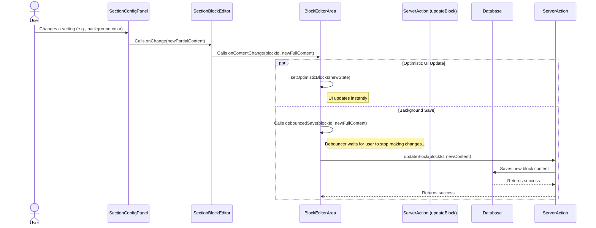

# Section Block Editor Refactor: Architectural Plan

## 1. Problem Analysis

*   **State Synchronization Failure (The "Change Twice" Bug):** State is managed inconsistently across multiple components (`BlockEditorArea`, `EditableBlock`, `SectionBlockEditor`). `BlockEditorArea` holds the primary `blocks` state, but `EditableBlock` and `SectionBlockEditor` also manage their own temporary or derived states (`tempBlockContent`, `processedContent`). When a change occurs in the `SectionConfigPanel`, the update has to travel through a complex chain of callbacks. This convoluted path, combined with `useEffect` dependencies, leads to stale state and requires a second action to synchronize the UI with the actual data.
*   **Poor Performance (Full-Page Refresh):** The `updateBlock` server action in `app/cms/blocks/actions.ts` calls `revalidatePath`. This is triggered on every single modification from the `SectionConfigPanel` (e.g., dragging a color picker), causing a full page reload and a terrible user experience.

## 2. Proposed Architecture: Optimistic UI & Debounced Background Saves

The new design will establish a clear, unidirectional data flow centered in `BlockEditorArea.tsx`. It will use React's `useOptimistic` hook for instantaneous UI updates and a debounced function to handle background saves efficiently.

### Data Flow Diagram



## 3. Implementation Plan

### Step 1: Modify the `updateBlock` Server Action

The first and simplest change is to prevent the disruptive page reload.

**File:** `app/cms/blocks/actions.ts`

**Modification:** Remove the `revalidatePath` calls from the `updateBlock` function. The UI will be handled optimistically, and data will be fresh on the next natural page load.

```typescript
// app/cms/blocks/actions.ts

export async function updateBlock(blockId: number, newContent: any, pageId?: number | null, postId?: number | null) {
  const supabase = createClient();
  const { data: { user } } = await supabase.auth.getUser();

  if (!user) return { error: "User not authenticated." };
  if (!(await canEditParent(supabase, user.id, pageId, postId))) {
    return { error: "Unauthorized to update this block." };
  }

  const { data, error } = await supabase
    .from("blocks")
    .update({ content: newContent, updated_at: new Date().toISOString() })
    .eq("id", blockId)
    .select()
    .single();

  if (error) {
    console.error("Error updating block:", error);
    return { error: `Failed to update block: ${error.message}` };
  }

  // REMOVE THESE LINES
  // if (pageId) revalidatePath(`/cms/pages/${pageId}/edit`);
  // if (postId) revalidatePath(`/cms/posts/${postId}/edit`);

  return { success: true, updatedBlock: data as Block };
}
```

### Step 2: Centralize State Management in `BlockEditorArea.tsx`

This is the core of the refactor. We will introduce `useOptimistic` and the debounced save function here.

**File:** `app/cms/blocks/components/BlockEditorArea.tsx`

**Modifications:**

1.  **Import `useOptimistic` and a debounce utility.** We'll use `lodash.debounce` for this example. You'll need to install it: `npm install lodash.debounce` and `npm install @types/lodash.debounce -D`.
2.  **Implement `useOptimistic`** to manage the blocks state.
3.  **Create a debounced save function** using `useCallback` and `debounce`.
4.  **Create a new `handleContentChange` callback** to pass down to the editors. This function will trigger both the optimistic update and the debounced save.
5.  **Remove the old state management logic** (`editingBlockId`, `tempBlockContent`, `handleSaveEdit`, etc.) as it will be replaced by the new, simpler flow.

```typescript
// app/cms/blocks/components/BlockEditorArea.tsx
"use client";

import React, { useState, useTransition, useEffect, useOptimistic, useCallback } from "react";
import debounce from 'lodash.debounce';
// ... other imports

// Keep the existing props
interface BlockEditorAreaProps {
  parentId: number;
  parentType: "page" | "post";
  initialBlocks: Block[];
  languageId: number;
}

export default function BlockEditorArea({ parentId, parentType, initialBlocks, languageId }: BlockEditorAreaProps) {
  // The 'server' state of the blocks
  const [blocks, setBlocks] = useState<Block[]>(() => initialBlocks.sort((a, b) => a.order - b.order));
  const [isPending, startTransition] = useTransition();

  // 1. IMPLEMENT useOptimistic
  const [optimisticBlocks, setOptimisticBlocks] = useOptimistic(
    blocks,
    (state: Block[], newBlock: Block) => {
      // This function defines how the state is updated optimistically
      return state.map(b => b.id === newBlock.id ? newBlock : b);
    }
  );

  // Update server state when initialBlocks changes (e.g., after a full page save/reload)
  useEffect(() => {
    setBlocks(initialBlocks.sort((a, b) => a.order - b.order));
  }, [initialBlocks]);

  // 2. CREATE a debounced save function
  const debouncedSave = useCallback(
    debounce(async (blockToSave: Block) => {
      await updateBlock(
        blockToSave.id,
        blockToSave.content,
        parentType === "page" ? parentId : null,
        parentType === "post" ? parentId : null
      );
      // After the save is confirmed, we can optionally re-sync the server state
      // This is good practice in case the server returns slightly different data
      startTransition(() => {
         setBlocks(prevBlocks => prevBlocks.map(b => b.id === blockToSave.id ? blockToSave : b));
      });
    }, 1000), // 1-second debounce delay
    [parentId, parentType]
  );

  // 3. CREATE a new content change handler
  const handleContentChange = (blockId: number, newContent: any) => {
    const updatedBlock = {
      ...optimisticBlocks.find(b => b.id === blockId)!,
      content: newContent,
    };

    // Immediately update the UI with the optimistic state
    setOptimisticBlocks(updatedBlock);

    // Trigger the debounced save function for background persistence
    debouncedSave(updatedBlock);
  };

  // ... (rest of the component logic for adding, deleting, reordering blocks)
  // This logic will now operate on `optimisticBlocks` for rendering
  // and call `setBlocks` when a server action is confirmed.

  return (
    // ...
    <SortableContext items={optimisticBlocks.map(b => b.id)} strategy={verticalListSortingStrategy}>
      <div>
        {optimisticBlocks.map((block) => (
          <SortableBlockItem
            key={block.id}
            block={block}
            // Pass the new handler down
            onContentChange={handleContentChange}
            // Remove old, unnecessary props
            // isEditing, onSetEditing, onSaveEdit, onCancelEdit, tempContent, onTempContentChange
            // ... other props like onDelete, onEditNestedBlock remain
          />
        ))}
      </div>
    </SortableContext>
    // ...
  );
}
```

### Step 3: Simplify `EditableBlock.tsx`

This component becomes much simpler. It no longer needs to manage editing state for sections and just passes the `onContentChange` callback down.

**File:** `app/cms/blocks/components/EditableBlock.tsx`

**Modifications:**

1.  **Update props:** Remove the old state management props and add `onContentChange`.
2.  **Simplify the `renderEditor` function:** Pass `onContentChange` directly to the editor component.

```typescript
// app/cms/blocks/components/EditableBlock.tsx

export interface EditableBlockProps {
  block: Block;
  onDelete: (blockId: number) => void;
  // NEW PROP
  onContentChange: (blockId: number, newContent: any) => void;
  // REMOVED PROPS: isEditing, onSetEditing, onSaveEdit, onCancelEdit, tempContent, onTempContentChange
  dragHandleProps?: any;
  onEditNestedBlock?: (parentBlockId: string, columnIndex: number, blockIndexInColumn: number) => void;
}

export default function EditableBlock({
  block,
  onDelete,
  onContentChange, // Use the new prop
  dragHandleProps,
  onEditNestedBlock,
}: EditableBlockProps) {
  // ... (state for config panel can remain)
  const [isConfigPanelOpen, setIsConfigPanelOpen] = useState(false);

  // ... (dynamic editor loading logic remains the same)

  const renderEditor = () => {
    // ... (logic to select EditorComponent remains)

    if (!EditorComponent) {
      // ...
    }

    const editorProps: any = {
      content: block.content || {}, // Always use content from the block prop
      // Pass a simplified onChange handler
      onChange: (newContent: any) => {
        onContentChange(block.id, newContent);
      },
      blockType: block.block_type,
      isConfigPanelOpen: isConfigPanelOpen,
    };

    return <EditorComponent {...editorProps} />;
  };

  // ... (rest of the component)
  // The component will always render the editor for a section block.
  // The concept of a separate "editing" mode for sections is removed in favor of an always-on config panel.
}
```

### Step 4: Adapt `SectionBlockEditor.tsx` and `SectionConfigPanel.tsx`

These components require minimal changes, as they already use an `onChange` callback. The key is ensuring they call `onChange` with the *full, updated content object* for the section.

**File:** `app/cms/blocks/editors/SectionBlockEditor.tsx`

**Modification:** Ensure the `onChange` call in the `SectionConfigPanel` handler merges content correctly. The existing code already does this, so it's more of a confirmation.

```typescript
// app/cms/blocks/editors/SectionBlockEditor.tsx

// ...
export default function SectionBlockEditor({
  content,
  onChange, // This now traces back to handleContentChange in BlockEditorArea
  isConfigPanelOpen,
}: SectionBlockEditorProps) {
  // ... (useMemo for processedContent is fine)

  return (
    // ...
      {isConfigPanelOpen && (
        <SectionConfigPanel
          content={processedContent}
          onChange={(newPartialContent) => {
            // This is correct: it merges and calls the parent onChange
            onChange({ ...processedContent, ...newPartialContent });
          }}
        />
      )}
    // ...
  );
}
```

The `SectionConfigPanel.tsx` needs no changes. Its `onChange` handler correctly provides partial content updates, which are handled by its parent, `SectionBlockEditor`.

## 4. Summary of Benefits

*   **Instantaneous UI:** `useOptimistic` ensures that any change made by the user is reflected in the UI immediately.
*   **Improved Performance:** Removing `revalidatePath` and debouncing the save function eliminates jarring page reloads and prevents the server from being overwhelmed with requests.
*   **Single Source of Truth:** State is now clearly owned and managed by `BlockEditorArea.tsx`, removing the bugs caused by desynchronized state across multiple components.
*   **Simplified Code:** The removal of complex state management logic (`tempContent`, `isEditing` flags for sections) makes the components easier to understand and maintain.