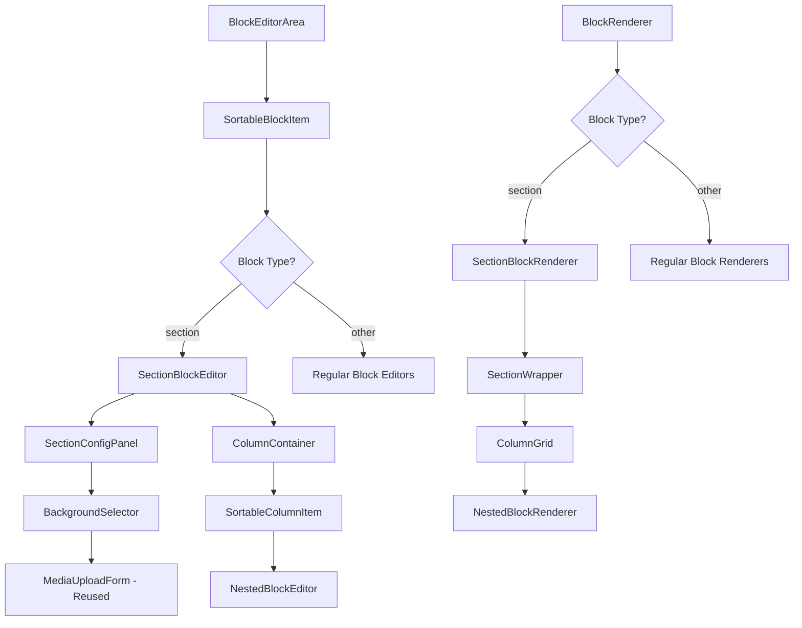
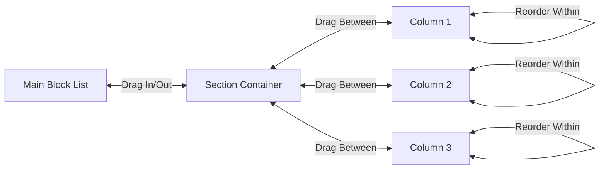

# Section/Column Layout System - Architectural Design Document

## Executive Summary

This document outlines the design for implementing a flexible section/column layout system in the Next.js CMS using an array-based approach that leverages the existing blocks table structure. The solution introduces a new "section" block type that contains an array of nested blocks, enabling multi-column layouts without requiring database schema changes.

## Current System Analysis

### Existing Architecture
- **Database**: [`blocks`](../supabase/migrations/20250514171553_create_blocks_table.sql:3) table with `id`, `page_id/post_id`, `language_id`, `block_type`, `content` (JSONB), `order`
- **Block Registry**: Centralized system in [`lib/blocks/blockRegistry.ts`](../lib/blocks/blockRegistry.ts:169) with TypeScript interfaces
- **Editor**: [`BlockEditorArea.tsx`](../app/cms/blocks/components/BlockEditorArea.tsx:52) handles drag-and-drop and CRUD operations
- **Renderer**: [`BlockRenderer.tsx`](../components/BlockRenderer.tsx:73) uses dynamic imports for rendering
- **Container System**: Uses `"container mx-auto px-4 py-8"` classes
- **Media System**: Existing [`MediaUploadForm.tsx`](../app/cms/media/components/MediaUploadForm.tsx) for image uploads

### Key Strengths to Leverage
1. Robust block registry system with TypeScript interfaces
2. Existing drag-and-drop functionality with DND Kit
3. Dynamic component loading system
4. JSONB content storage for flexibility
5. Established editor/renderer pattern
6. Existing media upload and management system

## Proposed Solution Architecture

### 1. Section Block Type Definition

```typescript
// New interface for section block content
export interface SectionBlockContent {
  container_type: 'full-width' | 'container' | 'container-sm' | 'container-lg' | 'container-xl';
  background: {
    type: 'none' | 'theme' | 'solid' | 'gradient' | 'image';
    theme?: 'primary' | 'secondary' | 'muted' | 'accent' | 'destructive';
    solid_color?: string;
    gradient?: {
      type: 'linear' | 'radial';
      direction?: string; // e.g., "to right", "45deg"
      stops: Array<{ color: string; position: number }>;
    };
    image?: {
      media_id: string;
      object_key: string;
      position: 'center' | 'top' | 'bottom' | 'left' | 'right' | 'cover' | 'contain';
      overlay?: {
        type: 'none' | 'solid' | 'gradient';
        color?: string;
        opacity?: number;
      };
    };
  };
  responsive_columns: {
    mobile: 1 | 2;
    tablet: 1 | 2 | 3;
    desktop: 1 | 2 | 3 | 4;
  };
  column_gap: 'none' | 'sm' | 'md' | 'lg' | 'xl';
  padding: {
    top: 'none' | 'sm' | 'md' | 'lg' | 'xl';
    bottom: 'none' | 'sm' | 'md' | 'lg' | 'xl';
  };
  column_blocks: Array<{
    block_type: BlockType;
    content: Record<string, any>;
    temp_id?: string; // For client-side management before save
  }>;
}
```

### 2. Component Architecture



### 3. Key Components to Create/Modify

#### New Components
1. **`app/cms/blocks/editors/SectionBlockEditor.tsx`** - Main section editor
2. **`components/blocks/renderers/SectionBlockRenderer.tsx`** - Frontend section renderer
3. **`app/cms/blocks/components/SectionConfigPanel.tsx`** - Section settings (container, background, columns)
4. **`app/cms/blocks/components/ColumnContainer.tsx`** - Individual column editor
5. **`app/cms/blocks/components/NestedBlockEditor.tsx`** - Block editor within sections
6. **`app/cms/blocks/components/BackgroundSelector.tsx`** - Background configuration UI (integrates with existing MediaUploadForm)
7. **`app/cms/blocks/components/ResponsiveColumnConfig.tsx`** - Column layout configuration

#### Modified Components
1. **`lib/blocks/blockRegistry.ts`** - Add section block definition
2. **`app/cms/blocks/components/BlockEditorArea.tsx`** - Enhanced drag-and-drop for nested blocks
3. **`components/BlockRenderer.tsx`** - Handle section block rendering

#### Reused Components
1. **`app/cms/media/components/MediaUploadForm.tsx`** - For background image uploads
2. **`app/cms/media/components/MediaGridClient.tsx`** - For selecting existing images
3. **`components/ui/*`** - All existing UI components

### 4. Drag-and-Drop Enhancement



#### Enhanced DND Context Structure
```typescript
interface EnhancedDragEndEvent extends DragEndEvent {
  active: {
    id: string;
    data: {
      current: {
        type: 'main-block' | 'section-block';
        sectionId?: number;
        columnIndex?: number;
        blockIndex?: number;
      };
    };
  };
  over: {
    id: string;
    data: {
      current: {
        type: 'main-list' | 'section-column';
        sectionId?: number;
        columnIndex?: number;
        insertIndex?: number;
      };
    };
  };
}
```

### 5. Background System Implementation

#### Theme-Based Backgrounds
```typescript
const themeBackgrounds = {
  primary: 'bg-primary text-primary-foreground',
  secondary: 'bg-secondary text-secondary-foreground',
  muted: 'bg-muted text-muted-foreground',
  accent: 'bg-accent text-accent-foreground',
  destructive: 'bg-destructive text-destructive-foreground'
};
```

#### Background Selector Integration
```typescript
// BackgroundSelector.tsx will integrate with existing media system
import MediaUploadForm from '@/app/cms/media/components/MediaUploadForm';
import MediaGridClient from '@/app/cms/media/components/MediaGridClient';

function BackgroundSelector({ background, onChange }) {
  const handleImageUpload = (media: Media) => {
    onChange({
      ...background,
      type: 'image',
      image: {
        media_id: media.id,
        object_key: media.object_key,
        position: 'cover'
      }
    });
  };

  return (
    <div className="space-y-4">
      {/* Theme, solid color, gradient options */}
      {background.type === 'image' && (
        <div>
          <MediaUploadForm onUploadSuccess={handleImageUpload} />
          <MediaGridClient onSelect={handleImageUpload} />
        </div>
      )}
    </div>
  );
}
```

#### Custom Background Rendering
```typescript
function generateBackgroundStyles(background: SectionBlockContent['background']) {
  switch (background.type) {
    case 'theme':
      return themeBackgrounds[background.theme!];
    case 'solid':
      return { backgroundColor: background.solid_color };
    case 'gradient':
      return {
        background: `${background.gradient!.type}-gradient(${background.gradient!.direction}, ${
          background.gradient!.stops.map(stop => `${stop.color} ${stop.position}%`).join(', ')
        })`
      };
    case 'image':
      return {
        backgroundImage: `url(${getImageUrl(background.image!.object_key)})`,
        backgroundPosition: background.image!.position,
        backgroundSize: background.image!.position === 'cover' ? 'cover' : 'contain'
      };
    default:
      return {};
  }
}
```

### 6. Responsive Column System

#### Tailwind CSS Grid Classes
```typescript
const columnClasses = {
  mobile: {
    1: 'grid-cols-1',
    2: 'grid-cols-2'
  },
  tablet: {
    1: 'md:grid-cols-1',
    2: 'md:grid-cols-2',
    3: 'md:grid-cols-3'
  },
  desktop: {
    1: 'lg:grid-cols-1',
    2: 'lg:grid-cols-2',
    3: 'lg:grid-cols-3',
    4: 'lg:grid-cols-4'
  }
};

const gapClasses = {
  none: 'gap-0',
  sm: 'gap-2',
  md: 'gap-4',
  lg: 'gap-6',
  xl: 'gap-8'
};

const paddingClasses = {
  none: '',
  sm: 'py-2',
  md: 'py-4',
  lg: 'py-8',
  xl: 'py-12'
};
```

### 7. Implementation Phases

#### Phase 1: Core Section Block (Week 1)
- [ ] Create `SectionBlockContent` interface in `lib/blocks/blockRegistry.ts`
- [ ] Add section block definition to block registry
- [ ] Implement basic `SectionBlockEditor.tsx` with fixed columns
- [ ] Implement basic `SectionBlockRenderer.tsx` with grid layout
- [ ] Basic column layout (fixed desktop columns, no backgrounds)
- [ ] Integration with existing block creation workflow

#### Phase 2: Enhanced Editor Experience (Week 2)
- [ ] Implement `SectionConfigPanel.tsx` for section settings
- [ ] Create `ColumnContainer.tsx` with drag-and-drop zones
- [ ] Implement `NestedBlockEditor.tsx` for inline block editing
- [ ] Add/remove blocks within sections functionality
- [ ] Basic background color and theme support
- [ ] Column gap and padding controls

#### Phase 3: Advanced Features (Week 3)
- [ ] Implement `BackgroundSelector.tsx` with media integration
- [ ] Add gradient background support with visual builder
- [ ] Background image support using existing `MediaUploadForm.tsx`
- [ ] Implement `ResponsiveColumnConfig.tsx` for breakpoint control
- [ ] Enhanced drag-and-drop between sections and main list
- [ ] Image overlay and positioning options

#### Phase 4: Polish & Migration (Week 4)
- [ ] Performance optimization and memoization
- [ ] Accessibility improvements (ARIA labels, keyboard navigation)
- [ ] Migration tools for converting existing blocks to sections
- [ ] Comprehensive testing and edge case handling
- [ ] Documentation and user guides
- [ ] Preview mode for responsive layouts

### 8. Database Considerations

#### No Schema Changes Required
The existing `blocks` table structure supports this implementation:
- `block_type` = "section"
- `content` (JSONB) stores the `SectionBlockContent` structure
- `order` maintains section positioning among other blocks

#### Content Storage Example
```json
{
  "container_type": "container",
  "background": {
    "type": "gradient",
    "gradient": {
      "type": "linear",
      "direction": "to right",
      "stops": [
        { "color": "#3b82f6", "position": 0 },
        { "color": "#8b5cf6", "position": 100 }
      ]
    }
  },
  "responsive_columns": {
    "mobile": 1,
    "tablet": 2,
    "desktop": 3
  },
  "column_gap": "md",
  "padding": {
    "top": "lg",
    "bottom": "lg"
  },
  "column_blocks": [
    {
      "block_type": "heading",
      "content": { "level": 2, "text_content": "Column 1 Title" }
    },
    {
      "block_type": "text",
      "content": { "html_content": "<p>Column 2 content...</p>" }
    },
    {
      "block_type": "image",
      "content": { "media_id": "123", "alt_text": "Column 3 image" }
    }
  ]
}
```

### 9. Block Registry Integration

#### Section Block Definition
```typescript
// Addition to lib/blocks/blockRegistry.ts
section: {
  type: "section",
  label: "Section Layout",
  initialContent: {
    container_type: "container",
    background: { type: "none" },
    responsive_columns: { mobile: 1, tablet: 2, desktop: 3 },
    column_gap: "md",
    padding: { top: "md", bottom: "md" },
    column_blocks: [
      { block_type: "text", content: { html_content: "<p>Column 1</p>" } },
      { block_type: "text", content: { html_content: "<p>Column 2</p>" } },
      { block_type: "text", content: { html_content: "<p>Column 3</p>" } }
    ]
  } as SectionBlockContent,
  editorComponentFilename: "SectionBlockEditor.tsx",
  rendererComponentFilename: "SectionBlockRenderer.tsx",
  contentSchema: {
    container_type: {
      type: 'union',
      required: true,
      description: 'Container width type',
      default: 'container',
      unionValues: ['full-width', 'container', 'container-sm', 'container-lg', 'container-xl']
    },
    background: {
      type: 'object',
      required: true,
      description: 'Background configuration',
      default: { type: 'none' }
    },
    responsive_columns: {
      type: 'object',
      required: true,
      description: 'Responsive column configuration',
      default: { mobile: 1, tablet: 2, desktop: 3 }
    },
    column_blocks: {
      type: 'array',
      required: true,
      description: 'Array of blocks within columns',
      default: []
    }
  },
  documentation: {
    description: 'A flexible section layout with responsive columns and background options',
    examples: [
      'Three-column layout with gradient background',
      'Two-column layout with image background',
      'Single column with theme-based background'
    ],
    useCases: [
      'Feature sections with multiple content blocks',
      'Comparison layouts and product showcases',
      'Hero sections with structured content',
      'Multi-column article layouts'
    ],
    notes: [
      'Blocks within sections can be edited inline',
      'Supports full drag-and-drop between columns and sections',
      'Background images are managed through existing media system',
      'Responsive breakpoints follow Tailwind CSS conventions'
    ]
  }
}
```

### 10. Migration Strategy

#### Backward Compatibility
- Existing blocks remain unchanged and fully functional
- New section blocks are additive to the system
- No breaking changes to current functionality
- Existing drag-and-drop behavior preserved for non-section blocks

#### Migration Tools
```typescript
// Optional: Convert existing blocks to sections
function convertBlocksToSection(blockIds: number[]): SectionBlockContent {
  const blocks = blockIds.map(id => getBlockById(id));
  
  return {
    container_type: 'container',
    background: { type: 'none' },
    responsive_columns: { 
      mobile: 1, 
      tablet: Math.min(2, blocks.length), 
      desktop: Math.min(4, blocks.length) 
    },
    column_gap: 'md',
    padding: { top: 'md', bottom: 'md' },
    column_blocks: blocks.map(block => ({
      block_type: block.block_type,
      content: block.content
    }))
  };
}

// Batch migration utility
async function migratePageToSections(pageId: number, sectionConfigs: Array<{
  blockIds: number[];
  containerType?: string;
  background?: any;
}>) {
  for (const config of sectionConfigs) {
    const sectionContent = convertBlocksToSection(config.blockIds);
    if (config.containerType) sectionContent.container_type = config.containerType;
    if (config.background) sectionContent.background = config.background;
    
    await createSectionBlock(pageId, sectionContent);
    await deleteBlocks(config.blockIds);
  }
}
```

### 11. Performance Considerations

#### Optimizations
1. **Lazy Loading**: Section components load only when needed using dynamic imports
2. **Memoization**: React.memo for nested block components to prevent unnecessary re-renders
3. **Virtual Scrolling**: For sections with many blocks (future enhancement)
4. **Debounced Updates**: Batch content changes during editing to reduce API calls
5. **Image Optimization**: Leverage existing media system's optimization features

#### Bundle Size Impact
- Estimated +20KB gzipped for new section components
- Dynamic imports minimize initial bundle impact
- Background selector and media components loaded on-demand
- Reuse of existing UI components minimizes additional overhead

#### Database Performance
- JSONB indexing on section content for faster queries
- Efficient nested block queries using existing patterns
- Minimal additional database load due to array-based storage

### 12. Accessibility & UX

#### Accessibility Features
- Proper ARIA labels for section containers and columns
- Keyboard navigation support for drag-and-drop operations
- Screen reader announcements for layout changes
- Focus management during editing and navigation
- High contrast support for background overlays
- Semantic HTML structure with proper heading hierarchy

#### User Experience Enhancements
- Visual indicators for drop zones during drag operations
- Preview mode for responsive layouts at different breakpoints
- Undo/redo functionality for section modifications
- Contextual help and tooltips for complex features
- Loading states and error handling for media uploads
- Intuitive column resizing and layout controls

#### Mobile Editor Experience
- Touch-friendly drag-and-drop on mobile devices
- Responsive editor interface that works on tablets
- Simplified controls for mobile editing
- Preview mode that matches actual mobile rendering

### 13. Testing Strategy

#### Unit Tests
- Section block content validation
- Background style generation
- Column layout calculations
- Drag-and-drop logic

#### Integration Tests
- Section creation and editing workflow
- Media upload integration
- Block migration between sections
- Responsive layout rendering

#### E2E Tests
- Complete section creation workflow
- Cross-browser drag-and-drop functionality
- Mobile responsive editing
- Background image upload and selection

### 14. Security Considerations

#### Content Validation
- Sanitize nested block content using existing validation
- Validate background image URLs and media IDs
- Prevent XSS through proper content escaping
- Validate column configurations and responsive settings

#### Media Security
- Leverage existing media upload security measures
- Validate image file types and sizes
- Secure media URL generation
- Proper access control for media selection

### 15. Future Enhancements

#### Potential Extensions
1. **Advanced Layout Options**: CSS Grid templates, flexbox layouts
2. **Animation Support**: Entrance animations, scroll-triggered effects
3. **Advanced Backgrounds**: Video backgrounds, parallax effects
4. **Layout Templates**: Pre-built section templates for common use cases
5. **Nested Sections**: Sections within sections for complex layouts
6. **Custom CSS**: Advanced users can add custom CSS to sections
7. **A/B Testing**: Built-in support for testing different section layouts

#### Integration Opportunities
1. **Design System**: Integration with component libraries
2. **Analytics**: Track section performance and engagement
3. **SEO**: Enhanced structured data for section content
4. **Internationalization**: Section-specific translation management

## Conclusion

This architecture provides a robust, scalable solution for section/column layouts while maintaining full compatibility with the existing system. The array-based approach effectively leverages the current JSONB storage, and the component architecture ensures maintainability and extensibility.

Key benefits of this approach:
- **No Database Changes**: Works with existing schema
- **Reuses Existing Systems**: Leverages media upload, UI components, and block patterns
- **Full Flexibility**: Supports complex layouts with comprehensive background options
- **Excellent UX**: Inline editing with full drag-and-drop support
- **Performance Optimized**: Lazy loading and efficient rendering
- **Future-Proof**: Extensible architecture for future enhancements

The phased implementation approach allows for iterative development and testing, ensuring each feature is solid before building upon it. The comprehensive background system and full drag-and-drop support will provide users with powerful layout capabilities while maintaining the intuitive editing experience they expect.

The integration with the existing media system ensures consistency and reduces development overhead, while the component architecture follows established patterns for easy maintenance and future enhancements.